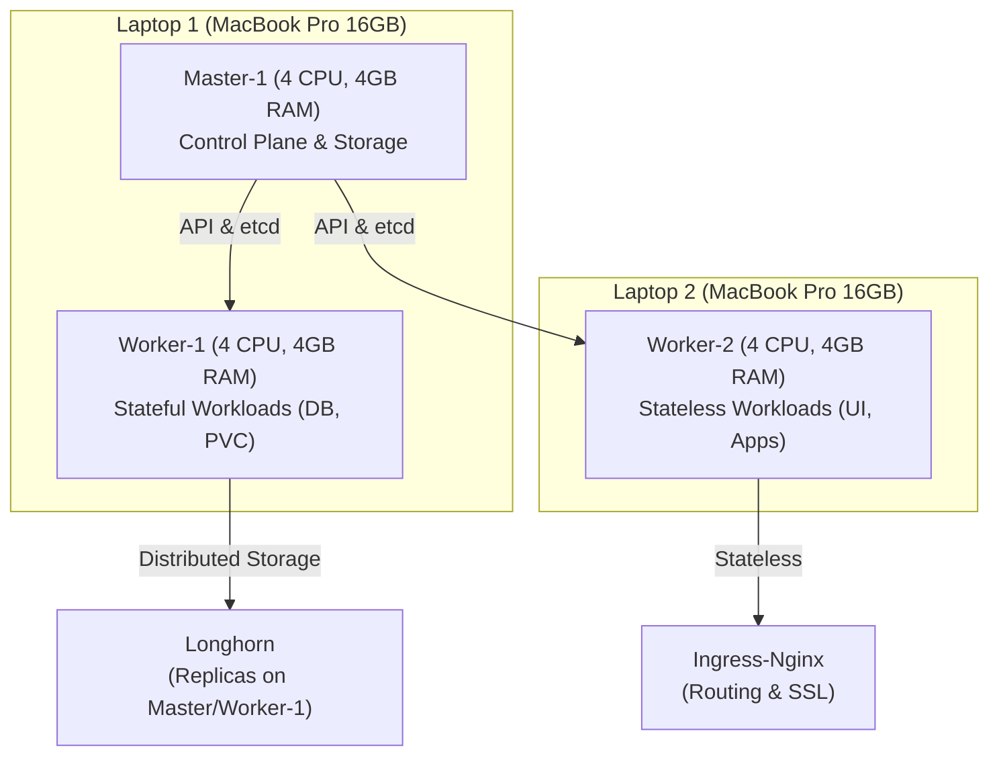

# Kubernetes Cluster on UTM (Apple Silicon)

> [!TIP]
> **View the [Master Project Context](../README.md)** for a high-level overview of the entire infrastructure and application stack.

Automated Kubernetes deployment for MacBook Pro M1/M2/M3 using UTM virtualization, spanning **2 laptops** with **intelligent workload distribution**.

---

## 🎯 What Is This?

A complete, automated setup that deploys Kubernetes across 2 MacBooks:
- **Master-1** (Laptop 1): Control plane + storage node
- **Worker-1** (Laptop 1): Stateful workloads (databases, volumes)
- **Worker-2** (Laptop 2): Stateless workloads (apps, UI) — **OPTIONAL, can power off**

---

## 🏗️ Architecture at a Glance

The cluster is designed for high availability across 2 physical MacBooks, with a focus on data persistence.



**Key Design Choice**: Stateful workloads (PostgreSQL, Redis) are pinned to **Worker-1** (storage node). If **Worker-2** (stateless node) goes offline, all services automatically reschedule to Worker-1 with zero data loss.

---

## ⚡ Quick Start (5 Steps)

### Step 1: Prerequisites

```bash
# On both MacBooks:
# 1. Install UTM: https://mac.getutm.app/
# 2. Install Ansible
brew install ansible

# 3. Configure AWS (if using S3 backups)
aws configure
# Enter: AWS Access Key, Secret, Region (eu-central-1)

# 4. Generate SSH key
ssh-keygen -t rsa -N "" -f ~/.ssh/id_rsa
```

### Step 2: Create Virtual Machines

```bash
cd kube-single-master/mac-vms

# Creates master-1 on Laptop 1
./vm-master.sh

# Creates worker-1 on Laptop 1
./vm-worker.sh 1

# Creates worker-2 on Laptop 2 (OPTIONAL)
./vm-worker.sh 2
```

**Wait 2-3 minutes for VMs to boot**

### Step 3: Update Inventory

```bash
cd ..
nano inventory.ini
```

Update IP addresses to match your VMs:
```ini
[k8s_masters]
master-1 ansible_host=192.168.0.101

[k8s_workers]
worker-1 ansible_host=192.168.0.121
worker-2 ansible_host=192.168.0.122
```

### Step 4: Deploy Kubernetes

```bash
./setup.sh
```

**⏱️ This takes 30-40 minutes. Grab coffee! ☕**

### Step 5: Verify Installation

```bash
# Copy kubeconfig to your laptop
scp ubuntu@192.168.0.101:/etc/kubernetes/admin.conf ~/.kube/config

# Check cluster
kubectl get nodes
# Output:
# NAME       STATUS   ROLES           AGE   VERSION
# master-1   Ready    control-plane   5m    v1.35.0
# worker-1   Ready    storage         5m    v1.35.0
# worker-2   Ready    stateless       5m    v1.35.0
```

✅ **Cluster is ready!**

---

## 📂 Project Structure

```
kube-single-master/
├─ README.md                    ← You are here
├─ setup.sh                     ← Manual setup alternative
├─ inventory.ini                ← Host IP addresses
│
├─ ansible/                     ← Automation Magic ✨
│  ├─ main.yml                  ← Master playbook (orchestrates everything)
│  ├─ ansible.cfg               ← Ansible settings
│  └─ tasks/
│     ├─ common.yml             ← OS prep (install containerd, etcd)
│     ├─ master-init.yml        ← Initialize Kubernetes API server
│     ├─ worker-join.yml        ← Join workers to cluster
│     ├─ node-topology.yml      ← Label worker-1 (storage) & worker-2 (stateless)
│     ├─ calico.yml             ← Pod networking (how pods talk)
│     ├─ helm.yml               ← Package manager for K8s
│     ├─ cert-manager.yml       ← Automatic HTTPS certificates
│     ├─ storage.yml            ← Longhorn distributed storage
│     ├─ metallb.yml            ← Load balancer for services
│     ├─ ingress-nginx.yml      ← HTTP/HTTPS router
│     ├─ argocd.yml             ← GitOps continuous deployment
│     ├─ aws.yml                ← AWS integration (S3 backups)
│     └─ kube-controller-manager.yml
│
├─ terraform/                   ← Cloud Infrastructure 🌥️
│  ├─ main.tf                   ← S3 bucket, backups, retention
│  ├─ outputs.tf                ← AWS credentials output
│  ├─ vars/
│  │  └─ common.yml             ← Variables (bucket name, region, etc)
│  └─ terraform.tfstate         ← State file (tracks resources)
│
└─ mac-vms/                     ← VM Creation Scripts 🖥️
   ├─ vm-master.sh              ← Creates master-1 in UTM
   └─ vm-worker.sh              ← Creates worker VMs in UTM
```

---

## 🔧 K8s Component Stack

### Control Plane & Core Services (Master-1)
Essential services that keep the cluster running and store its state.

| Component | Purpose | Port | Deployment |
|-----------|---------|------|------------|
| `kube-apiserver` | REST API for all K8s operations | 6443 | Static Pod |
| `etcd` | Distributed key-value store (State) | 2379 | Static Pod |
| `kube-scheduler` | Pod placement controller | 10251 | Static Pod |
| `CoreDNS` | Service discovery and DNS | 53 | Deployment |

### Data & Storage (Worker-1)
The "Brain" of the applications, handling persistent data.

| Component | Purpose | Storage Provider |
|-----------|---------|------------------|
| `Longhorn` | Distributed Block Storage | Local Storage |
| `PostgreSQL` | Blog main database | 20GB Longhorn PVC |
| `Redis` | Session and Data Caching | 2GB Longhorn PVC |
| `ArgoCD Controller` | GitOps heart (Stateful) | 1GB Longhorn PVC |

### Networking & Load Balancing
External access and internal routing.

| Component | Purpose | Traffic Flow |
|-----------|---------|--------------|
| `Calico` | Pod-to-Pod Network Fabric | Internal CNI |
| `MetalLB` | Local LoadBalancer (L2 Mode) | External IP -> Ingress |
| `Ingress-Nginx` | HTTP/HTTPS Routing | Ingress -> Service |
| `Cert-Manager` | Let's Encrypt / Self-Signed SSL | Auto TLS |

---

## 🎮 Common Operations

### Access ArgoCD UI

```bash
# Forward port from cluster to your machine
kubectl port-forward -n argocd svc/argocd-server 8080:80

# Open browser: http://localhost:8080
# Login: admin / (get password below)

# Get initial password
kubectl -n argocd get secret argocd-initial-admin-secret -o jsonpath="{.data.password}" | base64 -d
```

### View Cluster Logs

```bash
# Check what Ansible deployed
kubectl get all -A

# View events
kubectl get events -A --sort-by='.lastTimestamp'

# Check storage
kubectl get pvc -A
kubectl get longhorn volumes -A
```

### Monitor Nodes

```bash
# CPU/Memory usage
kubectl top nodes

# Node details
kubectl describe node worker-1

# See all pod assignments
kubectl get pods -A -o wide
```

### Manage Applications

```bash
# Deploy via ArgoCD (through GitHub)
git push  # to your manifests

# Or manual kubectl
kubectl apply -f deployment.yaml

# Check deployment status
kubectl rollout status deployment/iooding-blog -n iooding

# View logs
kubectl logs -f deployment/iooding-blog -n iooding

# Rolling update (new image)
kubectl set image deployment/iooding-blog \
  iooding=viktor2003/iooding:v10 -n iooding
```

---

## 🔄 Worker-2 Optional Design Explained

### Both Workers Online (Best Performance)

```
Master-1                Worker-1                Worker-2
├─ API Server    →    ├─ PostgreSQL    ←    ├─ ArgoCD UI
├─ etcd          →    ├─ Redis         ←    ├─ Ingress
└─ Scheduler     →    ├─ Blog App      ←    └─ Cert Manager
                       └─ Longhorn
```

✅ Full capacity, load balanced, fast

### Worker-2 Powered Off (Degraded But Safe)

```
Master-1                Worker-1
├─ API Server    →    ├─ PostgreSQL
├─ etcd          →    ├─ Redis
└─ Scheduler     →    ├─ Blog App
                       ├─ ArgoCD (rescheduled)
                       ├─ Ingress (rescheduled)
                       └─ Longhorn
```

⚠️ Slower (all on 1 node), but **NO DATA LOSS**

The key: Stateful workloads (database, storage) always on worker-1, stateless can reschedule!

---

## 🛡️ Node Labeling & Taints

Kubernetes decides where to schedule pods using:

### Labels (Information Tags)

```bash
# See labels on nodes
kubectl get nodes --show-labels

# Labels applied by node-topology.yml:
worker-1:  node-role.kubernetes.io/storage=true
worker-2:  node-role.kubernetes.io/stateless=true
```

### Taints (Rejection Rules)

```bash
# See taints on nodes
kubectl describe node worker-2 | grep Taints

# Taint applied by node-topology.yml:
worker-2:  stateless-only=true:NoSchedule
           ↑ Key=Value  ↑ Effect
           Only pods that tolerate this can schedule here
```

### How Pods Use This

```yaml
# PostgreSQL (MUST go to worker-1)
spec:
  nodeSelector:
    node-role.kubernetes.io/storage: "true"

# ArgoCD Server (CAN tolerate worker-2 taint)
spec:
  tolerations:
  - key: stateless-only
    operator: Equal
    value: "true"
    effect: NoSchedule
```

---

## 🔐 AWS S3 Backups

Your Longhorn volumes are backed up daily to AWS S3:

```
Every 2:00 AM UTC:
  PostgreSQL 20GB snapshot
    ↓
  Uploaded to S3
    ↓
  Stored for 7 days
    ↓
  Auto-deleted after 7 days
```

### Restore from Backup

```bash
# If local storage fails, download from S3
aws s3 ls s3://your-bucket/backups/

# Restore procedure:
# 1. Delete corrupted PVC
kubectl delete pvc postgres-data

# 2. Create new PVC (triggers new volume)
kubectl apply -f postgres.yaml

# 3. Restore data (via backup job or manual restore)
```

---

## 📊 Resource Allocation

Each VM: **4 CPU cores + 4GB RAM**

```
PostgreSQL:    500m CPU, 512Mi Memory  (most demanding)
Blog App:      100m CPU, 256Mi Memory
ArgoCD:        150m CPU, 512Mi Memory
Ingress-Nginx: 50m CPU,  128Mi Memory
Cert-Manager:  50m CPU,  128Mi Memory
─────────────────────────────────────────
Total:         ~850m CPU, 1.5GB Memory  ✅ Fits comfortably
```

If adding more apps, upgrade to 8GB RAM minimum.

---

## 🐛 Troubleshooting

### Pods Won't Schedule

```bash
# Check why pod is pending
kubectl describe pod <pod-name> -n <namespace>

# Common causes:
# 1. Node selector mismatch
#    Fix: Check node labels match pod nodeSelector
kubectl get nodes --show-labels

# 2. Taint not tolerated
#    Fix: Add tolerations to pod spec
kubectl describe node worker-2 | grep Taints

# 3. Not enough resources
#    Fix: Check node capacity
kubectl top nodes
kubectl describe node worker-1
```

### Cluster Won't Initialize

```bash
# Check master logs
ssh ubuntu@192.168.0.101
sudo journalctl -u kubelet -f

# Common issues:
# 1. Insufficient disk space
df -h

# 2. Network not ready
ping 192.168.0.121

# 3. SSH keys not configured
ssh-copy-id ubuntu@192.168.0.101
```

### Storage Issues

```bash
# Check Longhorn status
kubectl get longhorn -A
kubectl describe longhorn volume postgres-data

# View Longhorn UI
kubectl port-forward -n longhorn-system svc/longhorn-frontend 8081:80
# Open: http://localhost:8081
```

---

## 📚 Useful Commands

```bash
# Cluster Info
kubectl cluster-info
kubectl get nodes
kubectl get nodes -o wide

# Pods
kubectl get pods -A                    # All namespaces
kubectl get pods -n iooding            # Specific namespace
kubectl describe pod <pod-name> -n <ns>
kubectl logs -f <pod-name> -n <ns>     # Follow logs

# Storage
kubectl get pvc -A
kubectl get pv
kubectl describe pvc <pvc-name>

# Services & Ingress
kubectl get services -A
kubectl get ingress -A

# Events & Debugging
kubectl get events -A --sort-by='.lastTimestamp'
kubectl port-forward svc/argocd-server 8080:80 -n argocd

# Apply/Delete
kubectl apply -f file.yaml
kubectl delete -f file.yaml
```

---

## 🔗 Related Documentation

- **Parent Project**: See [../README.md](../README.md) for full architecture overview
- **Blog App**: See [../iooding/README.md](../iooding/README.md) for application details
- **Kubernetes Docs**: [kubernetes.io](https://kubernetes.io/docs/)
- **ArgoCD Docs**: [argo-cd.readthedocs.io](https://argo-cd.readthedocs.io/)
- **Longhorn Docs**: [longhorn.io](https://longhorn.io/docs/)

---

**Status**: ✅ Active & Maintained
**Last Updated**: January 2026
**Platform**: macOS M1/M2/M3 with UTM


## Getting Started

1. **Infrastructure**: Navigate to `/terraform` and run `terraform apply` to create the S3 bucket.
2. **VM Creation**: Use the scripts in `/mac-vms` to spin up your master and worker nodes.
3. **Inventory**: Copy `inventory.ini.example` to `inventory.ini` and update with your VM IP addresses.
4. **Deploy**: Run the main setup script:
   ```bash
   ./setup.sh
   ```

## Management

The cluster is managed via ArgoCD. Once deployed, you can access the ArgoCD UI and begin deploying your applications using GitOps.

## License
MIT
